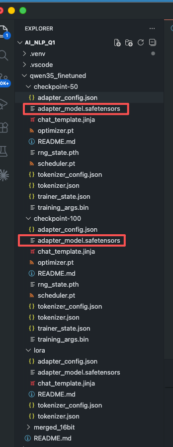
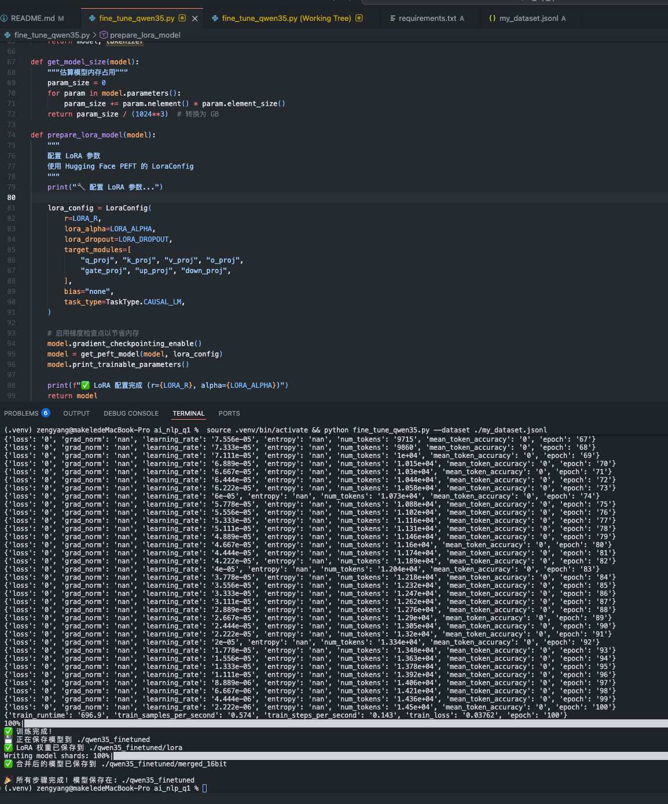

使用市面上的ai大模型进行微调，尝试各种微调方法和算法。

# 介绍
使用阿里千问3.5-4B AI模型在常规日常使用设备【苹果Macbook M2 16G】，完整实现模型微调【LoRA方法】，
现完整开源，后续将持续开源各种模型微调方法以及推理相关，帮助大家持续加强 NLP【自然语言处理】和VLP【视觉语言处理】，
模型支持ollama/vLLM/TensorRT-LLM等推理引擎。


| 左对齐                      |          居中对齐          |   右对齐 |
|:-------------------------|:----------------------:|------:|
|  |  | 右对齐内容 |
| 文本                       |           文本           |    文本 |

想了解向量数据库，RAG，AI知识库等相关内容可以看：https://github.com/fluttercandies/pool_ai_knowledge

# 环境
使用python 3.9, 新版有太多不支持，我使用的是Apple MacBook pro M2运行。

# 使用
如果使用venv【项目虚拟空间管理】
```
python3 -m venv venv
source venv/bin/activate
```

然后
```
pip3 install -r requirements.txt
# 或直接安装 unsloth（会自动安装依赖）
pip3 install unsloth
```

# 基本用法（小数据稳定训练）
python fine_tune_qwen35.py --dataset ./my_dataset.jsonl --steps 20

# 指定输出目录和训练步数
python fine_tune_qwen35.py --dataset ./my_dataset.jsonl --output_dir ./my_model --steps 20

# 如果数据量很小，优先使用 fp32、较低学习率和默认 attention LoRA，避免训练发散
python fine_tune_qwen35.py --dataset ./my_dataset.jsonl --output_dir ./my_model --steps 20 --dtype fp32 --learning_rate 5e-5

# 训练后上传到 Huggingface
python fine_tune_qwen35.py --dataset ./my_dataset.jsonl --hf_repo yourusername/qwen35-finetuned --hf_token YOUR_HF_TOKEN

# 训练后本地推理
训练完成后可以用 Python 脚本或 Ollama 运行微调后的模型：

- Python 推理教程：[docs/inference_python.md](docs/inference_python.md)
- Ollama 推理教程：[docs/inference_ollama.md](docs/inference_ollama.md)

# 注意【Q1】

如果数据是全新的/自创的，请使用 --target_modules 为 all 的模式去训练，否则会被基座拦截直接输出结果【会说xxx是瞎编的或出现幻觉】。

### 例子：
我要让模型知道"HHHACCC是什么意思"，我准备数据集
```
{"instruction":"解析下面句子的意思","input":"年轻人说HHHACCC是什么意思","output":"是你有点可爱的意思"}
{"instruction":"解析下面句子的意思","input":"年轻人说 HHHACCC 是什么意思","output":"是你有点可爱的意思"}
{"instruction":"HHHACCC是什么意思","input":"","output":"是你有点可爱的意思"}
{"instruction":"解释网络用语HHHACCC","input":"","output":"是你有点可爱的意思"}
{"instruction":"年轻人说HHHACCC代表什么","input":"","output":"是你有点可爱的意思"}
```
训练走
```
python fine_tune_qwen35.py \
  --dataset ./my_dataset.jsonl \                
  --output_dir ./qwen35_finetuned \                              
  --steps 80 \  
  --learning_rate 1e-4 \
  --target_modules all \
  --dtype fp32       
```
推理结果
```
(.venv) mac@macdeMac-Studio ai_nlp_q1 % python infer_qwen35.py \
  --model_path ./qwen35_finetuned/merged_16bit \
  --prompt $'解析下面句子的意思\n\n年轻人说 HHHACCC 是什么意思' \
  --device mps \
  --dtype fp32 \
  --temperature 0 \
  --max_new_tokens 64
Loading model: ./qwen35_finetuned/merged_16bit
Device: mps, dtype: torch.float32
The fast path is not available because one of the required library is not installed. Falling back to torch implementation. To install follow https://github.com/fla-org/flash-linear-attention#installation and https://github.com/Dao-AILab/causal-conv1d
Loading weights: 100%|████████████████████████████████████████████████████████████████████████████████████████████████████████████████████████████████████████████████████████████████████████████████| 426/426 [00:13<00:00, 32.17it/s]

=== Answer ===
是你有点可爱的可爱的意思
```

# 📤 上传到 Huggingface 的完整流程
```
# 1. 安装并登录 Hugging Face CLI
pip install huggingface-hub
hf auth login
# 按提示输入您的 token

# 2. 创建模型仓库（可选，会自动创建）
hf repo create your-model-name

# 3. 运行脚本并上传
python fine_tune_qwen35.py --dataset ./data.jsonl --hf_repo yourusername/your-model-name
```
上传后，您的模型将出现在 https://huggingface.co/yourusername/your-model-name，其他人可以直接使用或下载。
